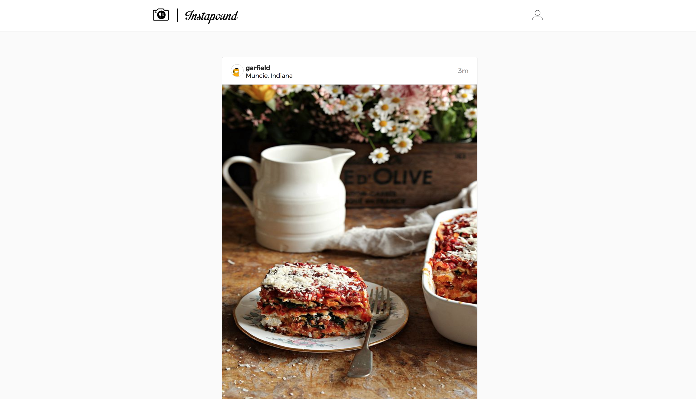
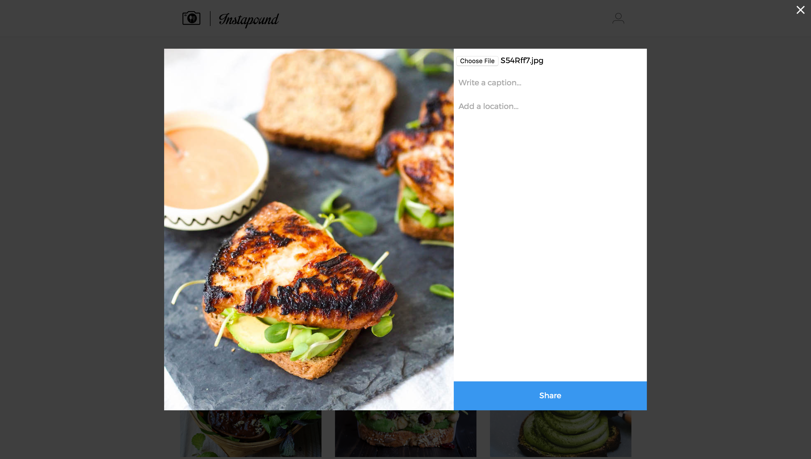

# Instapound

[Instapound Live][instalb]

[instalb]: https://www.instalb.com/

Inspired by Instagram, Instapound is a food themed, picture sharing app.  It utilizes Ruby on Rails on the backend, a PostgreSQL database, and React.js with a Redux architectural framework on the frontend.

## Features

* Authentication
  - A user cannot view pictures unless logged in.
* Post pictures or upload profile pictures.
* Like pictures
* Comment on pictures.
  - The owner of a picture can remove any comments made on the picture.
* Follow other users.
* Photofeed shows pictures of the user and all users the current user is following.
* User's profile page shows all pictures posted by user.

## Code Guide
* [instapound.jsx](./frontend/instapound.jsx)
* [React components](./frontend/components)
* [Rails controllers](./app/controllers/api)
* [API Util](./frontend/util/)
* [DB Schema](./db/schema.rb)
* [Rails Routes](./config/routes.rb)

## Technologies

* Ruby on Rails
* PostgreSQL
* React
* Redux
* jQuery
* Gems
  - Paperclip
  - Jbuilder
  - BCrypt
  - AWS
  - Figaro

## Screenshots
Login page:

Photofeed:

Profile page:

Picture upload:

Picture:

